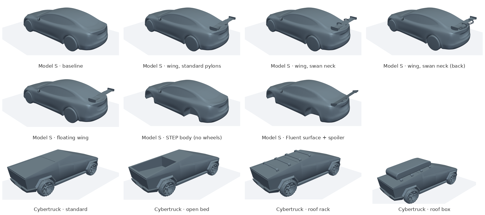

# cad2struct

[中文](README.md) | **English**

## CFD Vehicle Geometry Library

[`cfd_geometry/`](cfd_geometry/README.en.md): vehicle geometry extracted from public repositories and ready for external-aerodynamics CFD, organized by vehicle model.

- **Tesla Model S** ([details](cfd_geometry/tesla_model_s/README.en.md)): baseline + 4 rear-wing configurations with wheels (with an OpenFOAM case), plus the original STEP CAD without wheels and a body with a spoiler
- **Tesla Cybertruck** ([details](cfd_geometry/tesla_cybertruck/README.en.md)): 4 configurations (standard / open bed / roof rack / roof carrier box), each a complete OpenFOAM 12 case with MRF rotating wheels

Scripts for conversion, checking and rendering the preview images are in [`tools/`](tools/).
