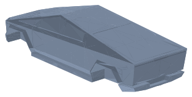
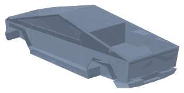
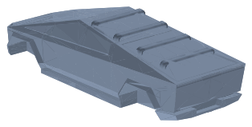
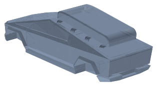

# Tesla Cybertruck — CFD 几何（OpenFOAM 12，四种配置）

来源：[liukushk-a/cybertruckAerodynamics](https://github.com/liukushk-a/cybertruckAerodynamics)（米兰理工学生项目）

> ⚠️ **原仓库没有任何许可声明**，默认保留所有权利。这里仅作内部研究整理用。如果要公开发布或用于论文，请先联系原作者取得授权。

每个子目录都是一个**完整、可直接运行**的 OpenFOAM 12 算例，几何放在 `constant/triSurface/` 下。我只删除了可再生成的文件（`*.eMesh`、`extendedFeatureEdgeMesh/`）、macOS 的 `.DS_Store`，以及 standard 目录里的两个 gmsh 草稿文件和一张结果图。

| 目录 | 配置 | 车身 STL | 车身三角面 | 原文 Cd |
|---|---|---|---:|---:|
| [`standard_closed_bed/`](standard_closed_bed) | 标准（货箱盖关闭） | `bodyCassoneChiuso_mm.stl` | 1,106 | 0.312 |
| [`open_bed/`](open_bed) | 货箱敞开 | `bodyCassoneAperto_mm.stl` | 1,096 | 0.375 |
| [`roof_rack/`](roof_rack) | 车顶行李架 | `bodyRoofrack_mm.stl` | 46,296（3 个实体） | 0.337 |
| [`roof_carrier_box/`](roof_carrier_box) | 车顶行李架 + 行李箱 | `bodyCassoneChiusoPortapacchi_mm.stl` | 57,246 | 0.408 |

| standard_closed_bed | open_bed | roof_rack | roof_carrier_box |
|---|---|---|---|
|  |  |  |  |

四个算例共用同一套车轮 `FR_mm.stl`（前轮）和 `RR_mm.stl`（后轮），每个 2,496 面、8 个闭合实体。四个算例之间只有车身 STL 和对应的 patch 名不同，求解设置完全一样。所有 STL 都已验证水密、法向一致。原文 Cd 取自 `postprocessing/cdBreak.py`。

## 坐标与单位

- 文件名里带 `_mm`，但**实际单位是米**（车长 5.683 m），直接用即可，不要再缩放。
- 车头朝 +x（x = 2.841），**来流方向为 −x**（inlet U = (−30, 0, 0) m/s）。
- 半车模型：计算域 y ∈ [−10, 0]，y=0 为 symmetry。车身 STL 是整车，车轮只有 −y 一侧。
- 地面 `tarmac` 位于 z = −0.8605；车轮底部压入地面约 1 cm。
- 计算域：x ∈ [−100, 20]，z ∈ [−0.86, 20]。

## 运行

```bash
cd standard_closed_bed      # 或其它三个配置
./Allrun.sh                 # blockMesh → surfaceFeatures → 6 核 snappyHexMesh → topoSet(MRF 区) → 6 核 foamRun
./Allclean.sh
```

求解器为 `foamRun` + `incompressibleFluid`，k-ω SST，共 5000 步。车轮用 MRF 区（`topoSetDict` 里的圆柱）加 `rotatingWallVelocity` 边界模拟旋转。`controlDict` 里自带 forceCoeffs 输出（magUInf 30，lRef 5.683，Aref 1.60 为半车迎风面积）。

原作者给出的网格规模约 800 万单元。`Allrun.sh` 写死了 6 核，需要的话请同时修改 `system/decomposeParDict`。

## 注意

- **MRF 转速单位疑似写错**：`constant/MRFProperties` 写的是 `rpm 67.887126`，但车轮壁面边界条件用的是 `omega 67.8871`（rad/s），而 30 m/s ÷ 0.442 m 轮半径 = 67.9 rad/s。也就是说，这个 rad/s 的数值被写在了 `rpm` 键下，MRF 区实际只转 7.1 rad/s，和轮面转速对不上。建议把 `rpm 67.887126;` 改成 `omega 67.887126;`。这里保留了原文件，没有改动。
- 原仓库里 `CAD modifications/roofrack_1_4pz.stl` 是单独的行李架零件（单位 mm，没有车身），已经合并进 `roof_rack/` 的车身 STL，所以没有单独拷过来。

## 后处理脚本

`postprocessing/` 是原仓库的 `pythonCodes/`：
- `cdBreak.py`：四种配置的 Cd 对比图
- `gridConv.py`：网格收敛曲线（交互输入）
- `mediumCoefficients.py`、`Autonomy.py`：系数平均、续航估算
