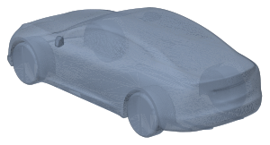
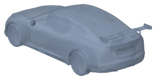
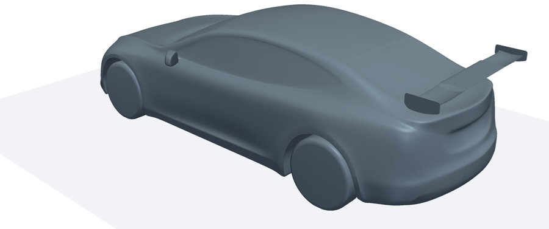
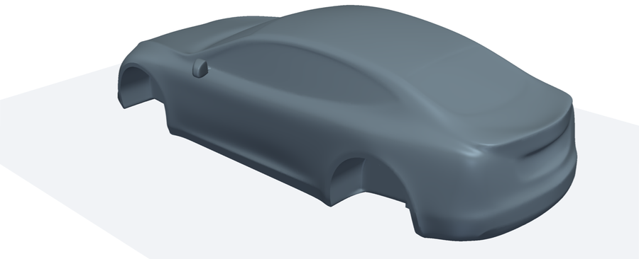
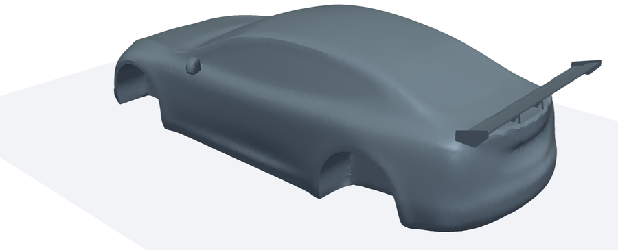

# Tesla Model S — CFD 几何

两个来源，坐标系相同（都来自同一个公开的 Model S 模型，车长 4.97 m、车宽 2.166 m）：

- x 轴：车头在 x≈0.013，车尾在 x≈4.98，**来流方向为 +x**
- y 轴：以 y=0 为对称面
- z 轴向上
- 单位：**米**（所有 STL 都已统一换算成米）

| 子目录 | 来源 | 许可 | 求解器 |
|---|---|---|---|
| [`polimi_openfoam/`](polimi_openfoam) | [alejandro-rivera-miguez/CFD-analysis-of-Tesla-Model-S-Rear-Wing-Attachment-Aerodynamics](https://github.com/alejandro-rivera-miguez/CFD-analysis-of-Tesla-Model-S-Rear-Wing-Attachment-Aerodynamics) | MIT | OpenFOAM (ESI), simpleFoam + k-ω SST |
| [`fluent_spoiler/`](fluent_spoiler) | [MohamedSamer1/tesla-model-s-spoiler-cfd-analysis](https://github.com/MohamedSamer1/tesla-model-s-spoiler-cfd-analysis) | MIT | ANSYS Fluent, 标准 k-ε |

---

## A. `polimi_openfoam/` — 带车轮，五种尾翼配置（OpenFOAM 可直接跑）

原始文件是 `Geometry.rar` 里 CATIA 导出的 ASCII STL。这里已解压，并转成二进制 STL（体积约为原来的 1/4，几何不变）。

| 文件 | 配置 | 三角面 | 实体数 | 说明 |
|---|---|---:|---:|---|
| `stl/baseline.stl` | 原车 | 203,204 | 1 | 含车轮，轮胎压入地面 14 mm（z_min = −0.014） |
| `stl/rearwing_standard_pylons.stl` | 尾翼 + 标准立柱 | 212,806 | 2 | |
| `stl/rearwing_swan_neck.stl` | 尾翼 + 鹅颈吊挂 | 212,754 | 4 | |
| `stl/rearwing_swan_neck_back.stl` | 尾翼 + 后伸鹅颈吊挂 | 212,450 | 4 | 吊挂伸出车尾，x_max = 5.045 |
| `stl/rearwing_floating_no_mounts.stl` | 悬浮尾翼，无支架 | 211,810 | 2 | 原文件是 **mm**，已乘 0.001 换算成 m |

| baseline | standard_pylons | swan_neck | swan_neck_back | floating_no_mounts |
|---|---|---|---|---|
|  |  |  |  |  |

所有文件都是水密的（watertight），法向一致。尾翼和支架是与车身相交的独立闭合实体，snappyHexMesh 能直接处理。

### 运行

`openfoam_case/` 是原仓库的 `Simulation_setup/`。我删掉了过时的 `0.orig/`（那是 motorBike 教程的残留，和本算例不匹配），并新增了一个 `Allrun`：

```bash
cd polimi_openfoam/openfoam_case
./Allrun rearwing_swan_neck 8     # 变体名 = stl/ 下的文件名；8 = 核数
./Allclean                        # 清理（会一并删掉 constant/triSurface）
```

`Allrun` 会把选中的 STL 复制成 `constant/triSurface/TeslaModelS_RearWing_front.stl`（所有字典都写死了这个名字），然后依次运行 blockMesh → surfaceFeatureExtract → 并行 snappyHexMesh → checkMesh → 并行 simpleFoam。

工况：半车模型（y ∈ [0, 4] m，y=0 为 symmetryPlane）；计算域 x ∈ [−15, 40] m，z ∈ [0, 7] m；U∞ = 55 m/s；地面为 fixedValue U=U∞（移动地面）；k-ω SST；共 1500 步。

**实测**：用 OpenFOAM v1912 跑了 `./Allrun rearwing_swan_neck 4`（仅测试时把分解方法换成 `simple`，因为 Debian 的 v1912 包没带 scotch）。snappyHexMesh 报告 "Finished meshing without any errors"，生成 512 万网格（含 5 层边界层），4 核耗时约 40 分钟。checkMesh 只有 29 个高偏斜面（max skewness 6.75）。simpleFoam 跑了 3 步，残差正常下降。字典的文件头标的是 **v2406**；在 v1912 下 `forceCoeffs` 函数对象会报错，需要加 `-noFunctionObjects` 才能跑，建议用 v2406 及以上版本。

> ⚠️ `system/forceCoeffs` 里 `Aref 2.2` 是整车迎风面积，但计算域只有半车，所以输出的 Cd/Cl 是真实值的一半。要么把 Aref 改成 1.1，要么把结果乘 2。

---

## B. `fluent_spoiler/` — 无车轮车身 + 扰流板

| 文件 | 说明 |
|---|---|
| `step/tesla_model_s_base.stp` | 原始 STEP（Autodesk 导出，单实体，mm）。**没有车轮**，轮拱处直接封闭，车身底部离 z=0 有 154 mm。 |
| `step/rear_spoiler_part.step` | SolidWorks 扰流板零件，**使用自己的局部坐标系，没有装到车上**。展长 2.855 m，比车还宽。原作者是在 SpaceClaim（`.scdocx`）里缩放并定位的，没有导出装配好的 STEP。 |
| `stl/baseline_from_step.stl` | 用 gmsh 由上面的 STEP 三角化得到（304,720 面，m，水密）。**最适合重新划网格的无尾翼几何。** |
| `stl/with_spoiler_fluent_surface.stl` | 从 Fluent 网格 `car-with-spoiler/FFF.msh.h5` 的 `car` 壁面提取：原本是半车，已镜像拼成整车，并平移回 STEP 坐标系（96,242 面，水密）。**这是唯一一份扰流板已装好位置的几何**，即 Fluent 实际计算用的形状。精度受 Fluent 面网格限制。 |
| `stl/baseline_fluent_surface.stl` | 同上，来自无尾翼网格 `FFF 1.msh.h5`（89,518 面）。 |
| `stl/rear_spoiler_part_from_step.stl` | 扰流板零件的三角化结果（局部坐标系，未定位）。 |

| baseline_from_step | with_spoiler_fluent_surface |
|---|---|
|  |  |

Fluent 原始工况：半车对称模型，速度入口 / 压力出口，静止地面位于 z = −0.046 m（在 STEP 坐标系下），pressure-based 稳态求解，标准 k-ε，SIMPLE 算法。这些几何没有现成的 OpenFOAM 字典。可以直接套用 A 里的 `openfoam_case`：把 STL 复制成 `constant/triSurface/TeslaModelS_RearWing_front.stl` 即可。注意这台车没有车轮，是悬空的。

原仓库里的 Fluent `.cas.h5` / `.dat.h5` / `.msh.h5` 体积较大（约 100 MB），没有拷过来，需要时请去原仓库下载。
